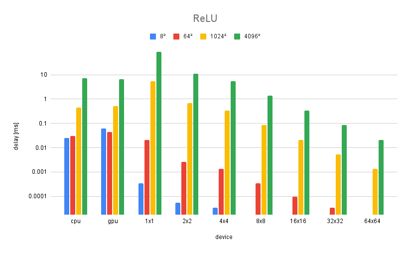
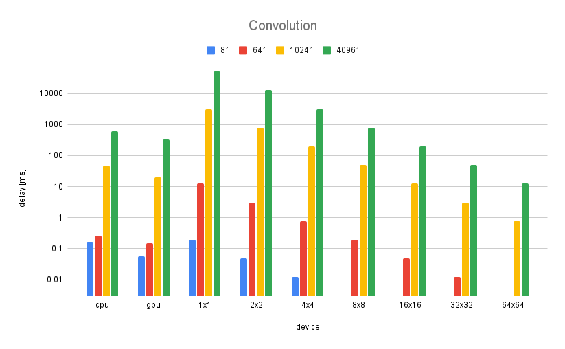
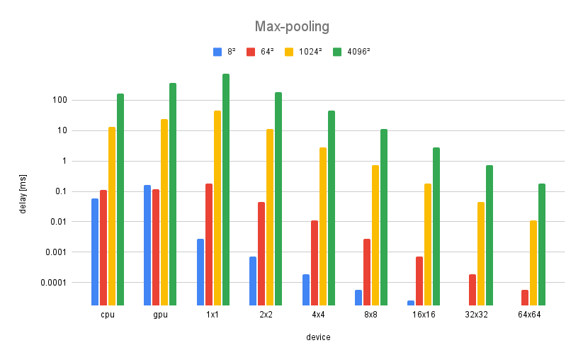
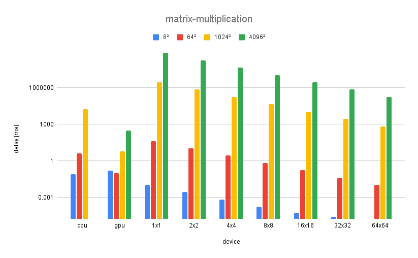

# A Minimal Machine Learning Processor
VLSI 1 Final Project by Michael Ebenstein (control_cell) and Ian SymSmith (compute_tile)

<table>
    <tbody>
        <tr>
            <td></td>
            <td rowspan=2></td>
        </tr>
        <tr>
            <td> </td>
        </tr>
    </tbody>
</table>

### Instructions

1. Place you instructions and initial memory blocks in the `projectdata/images` folder, and replace `program.data` and `weights.data` respectively. 
2. Compile the design

```bash
module load synopsys/2018
vcs -full64 -f cmd_fl -debug
```

3. Launch the simulator

```bash
./simv -gui &
```

### Results
#### Addition


#### ReLU


#### Convolution


#### Max-Pooling


#### Matrix-multiplication

# VLSI_NaiveML
